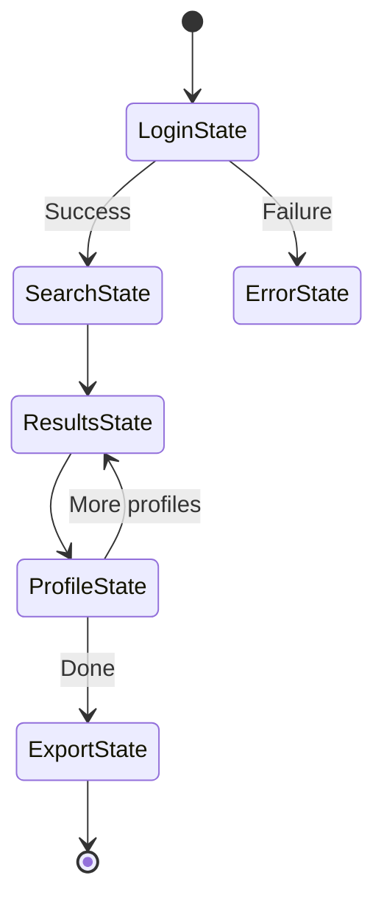

# State Machine Diagram

## ASCII State Machine Diagram

```
                    ┌─────────────┐
                    │   START     │
                    └──────┬──────┘
                           │
                           ▼
                    ┌─────────────┐
                    │  Initialize │
                    │   Context   │
                    └──────┬──────┘
                           │
                           ▼
        ┌──────────────────────────────────┐
        │                                  │
        ▼                                  ▼
┌───────────────┐                  ┌───────────────┐
│  State        │                  │  State        │
│  Detection    │◄─────────────────│  Execution    │
│  (Poll States)│                  │  (Run Logic)  │
└───────┬───────┘                  └───────┬───────┘
        │                                  │
        │ Found Active State               │
        │                                  │
        ▼                                  │
┌───────────────┐                          │
│  Enter State  │                          │
│  (Setup)      │                          │
└───────┬───────┘                          │
        │                                  │
        │                                  │
        ▼                                  │
┌───────────────┐                          │
│  Execute      │──────────────────────────┘
│  State Logic  │
│  (Scrape)     │
└───────┬───────┘
        │
        │ Cascade Selectors
        │ Primary → Fallback → Visual
        │
        ▼
┌───────────────┐
│  Transition?  │
│  (Next State) │
└───────┬───────┘
        │
        ├──► Yes ──► ┌───────────────┐
        │            │  Exit State   │
        │            │  (Cleanup)    │
        │            └───────┬───────┘
        │                    │
        │                    ▼
        │            ┌───────────────┐
        │            │  Transition   │
        │            │  (Navigate)   │
        │            └───────┬───────┘
        │                    │
        │                    └───► Loop back to Detection
        │
        └──► No ──► ┌───────────────┐
                    │   COMPLETE    │
                    │  (Export Data)│
                    └───────────────┘
```

## Example: LinkedIn Scraping Flow

```
                    ┌─────────────┐
                    │   START     │
                    └──────┬──────┘
                           │
                           ▼
                    ┌─────────────┐
                    │  LoginState │
                    │  (Detect:   │
                    │   /login)   │
                    └──────┬──────┘
                           │
                           │ Success
                           ▼
                    ┌─────────────┐
                    │ SearchState │
                    │  (Detect:   │
                    │   /search)  │
                    └──────┬──────┘
                           │
                           │ Submit Query
                           ▼
                    ┌─────────────┐
                    │ResultsState │
                    │  (Detect:   │
                    │   results)  │
                    └──────┬──────┘
                           │
                           │ For each profile
                           ▼
                    ┌─────────────┐
                    │ProfileState │
                    │  (Detect:   │
                    │   /in/)     │
                    └──────┬──────┘
                           │
                           ├──► More profiles? ──► ResultsState
                           │
                           └──► Done? ──► ┌─────────────┐
                                         │ ExportState │
                                         └─────────────┘
```

## Cascade Selector Flow

```
                    ┌─────────────┐
                    │   Element   │
                    │  Detection  │
                    └──────┬──────┘
                           │
                           ▼
                    ┌─────────────┐
                    │   Primary   │
                    │   Selector  │
                    │  (XPath/CSS)│
                    └──────┬──────┘
                           │
                           ├──► Success ──► Return Element
                           │
                           └──► Fail ──► ┌─────────────┐
                                        │  Fallback 1 │
                                        │  (Broader)  │
                                        └──────┬──────┘
                                               │
                                               ├──► Success ──► Return Element
                                               │
                                               └──► Fail ──► ┌─────────────┐
                                                            │  Fallback 2 │
                                                            │  (Generic)  │
                                                            └──────┬──────┘
                                                                   │
                                                                   ├──► Success ──► Return Element
                                                                   │
                                                                   └──► Fail ──► ┌─────────────┐
                                                                                │   Visual    │
                                                                                │  Detection  │
                                                                                │  (OCR/SS)   │
                                                                                └──────┬──────┘
                                                                                       │
                                                                                       ├──► Success ──► Return Element
                                                                                       │
                                                                                       └──► Fail ──► Error/Retry
```

## Error Handling Flow

```
                    ┌─────────────┐
                    │   Normal    │
                    │   State     │
                    └──────┬──────┘
                           │
                           │ Error Detected
                           ▼
                    ┌─────────────┐
                    │  ErrorState │
                    │  (Classify) │
                    └──────┬──────┘
                           │
        ┌──────────────────┼──────────────────┐
        │                  │                  │
        ▼                  ▼                  ▼
┌─────────────┐   ┌─────────────┐   ┌─────────────┐
│  Retryable  │   │  Rate Limit │   │  Fatal      │
│   Error     │   │   Error     │   │   Error     │
└──────┬──────┘   └──────┬──────┘   └──────┬──────┘
       │                 │                  │
       │ Retry           │ Wait + Backoff   │ Stop
       │                 │                  │
       ▼                 ▼                  ▼
┌─────────────┐   ┌─────────────┐   ┌─────────────┐
│  RetryState │   │  Backoff    │   │ FailureState│
│  (N times)  │   │   State     │   │  (Log)      │
└──────┬──────┘   └──────┬──────┘   └─────────────┘
       │                 │
       │ Success         │ Resume
       │                 │
       └─────────┬───────┘
                 │
                 ▼
         ┌─────────────┐
         │  Return to  │
         │  Normal Flow│
         └─────────────┘
```

## Notes

- **Solid arrows** = Normal transitions
- **Dashed arrows** = Error/conditional transitions
- **Diamond shapes** = Decision points (implicit in ASCII)
- **Rectangles** = States
- **Rounded rectangles** = Start/End points

For a visual diagram, consider using:
- [Mermaid](https://mermaid.js.org/) (text-based diagrams)
- [PlantUML](https://plantuml.com/) (UML diagrams)
- [Draw.io](https://draw.io/) (Visual editor)

Example Mermaid syntax:




